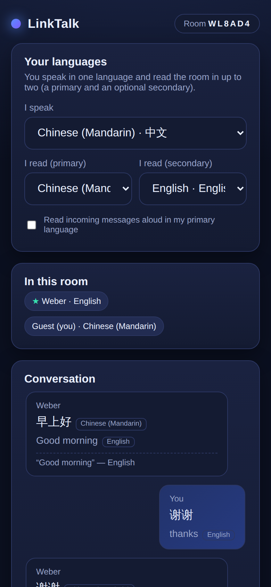

# LinkTalk — multi-device live translation

**Everyone speaks their own language. Everyone reads the room in their own.**

One phone hosts a room; other phones join by **QR code, invite link, or a
face-to-face share** (AirDrop / Nearby Share / NFC tap). Once you're in, anything
one person says — typed or spoken aloud — appears on everyone else's screen,
**translated into each person's chosen language(s)** in real time. Each participant
picks the language they speak in and up to two languages they read in (a primary
and an optional secondary).

It's a cross‑platform **web app (PWA)**, so it runs in the browser on iOS and
Android with nothing to install — and installs to the home screen if you want.



---

## How it maps to the requested features

| Requirement | How LinkTalk does it |
| --- | --- |
| 多台手机连接，一台为主机 (multiple phones, one host) | A host taps **Create room**; the server mints a 6‑char room code. Everyone else joins that room over WebSocket. |
| 生成邀请二维码或链接 (invite QR code / link) | The host screen shows a **QR code** and a copyable **invite link** (`/room.html?room=CODE`). Scanning or opening either lands the guest straight in the room. |
| 扫码或添加链接加入 (join by scan or link) | Open the link / scan the QR → auto‑join. Or type the 6‑character code on the home screen. |
| AirDrop / NFC 面对面碰接加入 (face‑to‑face join) | The **Share** button uses the Web Share API — on iPhone that surfaces **AirDrop**, on Android **Nearby Share**. Android Chrome also gets a **Tap to NFC** button that writes the invite to an NFC tag for tap‑to‑join. All of them just carry the same room link. |
| 一人发言同步到其他人屏幕 (one person's speech syncs to all screens) | Messages relay through a WebSocket server to every device in the room instantly. You can **type** or **dictate** (Web Speech API speech‑to‑text); interim words even preview live as you speak. |
| 接收方设定默认发言语言和接收语言 (per‑user speak + receive language) | Each person sets **I speak** (one language) and **I read (primary)**. Choices are remembered on the device. |
| 最多支持 2 个，一主一次 (max 2, one primary + one secondary) | A second **I read (secondary)** slot (optional). Every incoming message is shown in your primary language, then your secondary, with the original kept underneath. |

Bonus niceties: optional **read‑aloud** (text‑to‑speech) of incoming messages in
your primary language, live roster of who's in the room, and auto‑reconnect.

---

## Architecture

```
┌──────────────┐   WebSocket    ┌───────────────────────┐   WebSocket   ┌──────────────┐
│  Host phone  │ ─────────────▶ │   Node relay server   │ ◀───────────── │ Guest phone  │
│  (browser)   │ ◀───────────── │  rooms · QR · trans.  │ ─────────────▶ │  (browser)   │
└──────────────┘                └───────────────────────┘                └──────────────┘
```

- **`server.js`** — Express static host + WebSocket relay. Manages rooms (in
  memory), mints invite codes, renders join QR codes, and exposes a translation
  proxy so the browser needs no API keys and hits no CORS walls.
- **`public/`** — the PWA. `index.html` (create / join), `room.html` (the room),
  `js/room.js` (the client), `js/langs.js` (language table), `css/style.css`.
- **`phrasebook.js`** — a small offline phrasebook fallback (see below).

**Translation happens on the receiver's device.** The server relays only the
original text plus its source language; each receiving phone translates into
*its own* primary/secondary languages. That's what lets ten people read the same
sentence in ten different languages.

---

## Running it

```bash
npm install
npm start          # http://localhost:3000
```

Open it on your computer to try it, or — to use it across real phones — expose
the port over your LAN or a tunnel (e.g. `ngrok http 3000`) and open the printed
URL on each phone. The QR code and invite link automatically use whatever host
the phone reached the server through.

> **HTTPS note:** microphone dictation, the Web Share API, and Web NFC require a
> secure context. `localhost` counts as secure; for other phones use an HTTPS
> tunnel. Plain text messaging works without HTTPS.

### Tests

```bash
# REST + translation chain + WebSocket relay
PORT=3111 node server.js &
node test/e2e.mjs

# Full browser flow (two phones, real translation rendering) — needs Chromium
PORT=3111 node server.js &
node test/browser.mjs
```

---

## Translation provider

By default LinkTalk uses the free, key‑less **MyMemory** endpoint — no signup.
If that host is blocked by your network's egress policy, or you'd rather self‑host,
point it at another provider with environment variables:

| Variable | Meaning | Default |
| --- | --- | --- |
| `TRANSLATE_URL` | URL template with `{q}`, `{from}`, `{to}` placeholders | MyMemory |
| `TRANSLATE_PICK` | dot‑path to the translated string in the JSON response | `responseData.translatedText` |
| `TRANSLATE_OFFLINE` | set to `1` to skip the network entirely | off |

When the live provider is unreachable, LinkTalk falls back to a small, hand‑checked
**offline phrasebook** (`phrasebook.js`) covering common conversational phrases in
English, Chinese, Spanish, French, German, and Japanese — so the demo still shows
real translation offline. Anything not in the phrasebook is shown in its original
language, clearly labelled, until the live provider is reachable.

---

## Notes & limitations

- **Rooms are in memory.** A room disappears when its last device leaves; there's
  no database. Perfect for ad‑hoc conversations, not for persistence.
- **True AirDrop / NFC** are OS‑level transports. A pure web app can't open the
  AirDrop radio directly, so LinkTalk uses the browser's Web Share API (which
  *invokes* AirDrop / Nearby Share) and Web NFC where the platform allows. A native
  iOS/Android wrapper could deepen this, but the join payload — the room link —
  is identical.
- **Speech‑to‑text** relies on the browser's Web Speech API (great on Chrome and
  Safari; absent elsewhere). Typing always works as a fallback.
